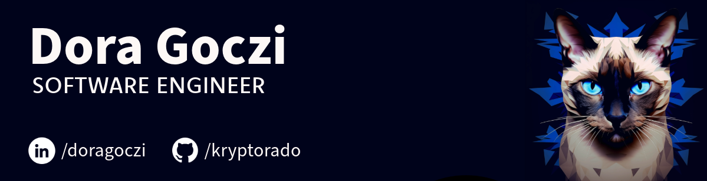

# Hi, I'm Dora 👋🏻🐱‍👤

- **Full-Stack Developer 🖥️**: Passionate about building secure, scalable, and responsive software solutions. Proficient in Python, JavaScript, Java, and experienced with frameworks like the MERN stack, Flask, and Spring Boot.

- **Problem Solver 🧩**: I enjoy tackling technical challenges and designing innovative solutions. Always eager to learn new skills and technologies.
 
- **Engineering Graduate 🎓**: Bachelor of Applied Science in Computer Engineering from the University of Waterloo, graduated in June 2022.

- **Current Project 🔭**: Working on **myVitals Health Data Visualization Webapp**

- **Learning Now 🌱**: Diving into **Flask, Kubernetes, MongoDB**

- **Fun Fact ⚡**: I enjoy making sourdough bread 🍞

## Connect with me:

## Languages and tools
 
 
 
 
 
 
 
 
 
 
 
 
 
 
 

 

 
 
 
 
 
 
 
 
 
 

<table border="0">
<tr style="border: none">
    <td style="border: none">
        
    </td>
    <td style="border: none;">

## Find me around the web 🌎: 
- View my projects on my portfolio site <a href="https://kryptorado.github.io/">kryptorado.github.io</a> 📹 ✍🏾
- Add me on  <a href="https://www.linkedin.com/in/doragoczi/">LinkedIn</a> 💼
- See my past hackathons on <a href="https://devpost.com/kryptorado">Devpost</a> 📹 ✍🏾
- Check out my blogs on <a href="https://medium.com/@doribea"> Medium</a>
    </td>
</tr>
</table>
